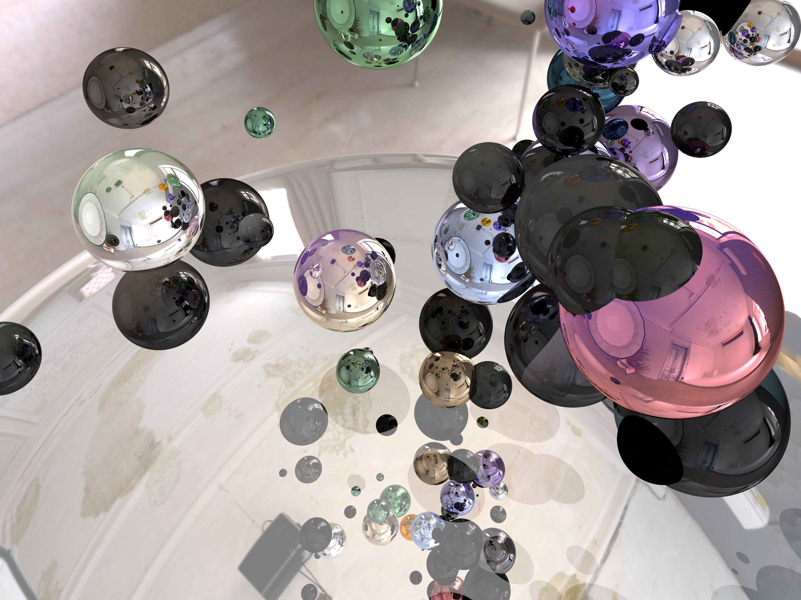

# Unity shaders and VFX study

URP, Unity 2022.3.22f1

### Simple Raytracing.
Heavely based on article [GPU Ray Tracing in Unity – Part 1](https://pages.github.com/](https://www.gamedeveloper.com/programming/gpu-ray-tracing-in-unity-part-1 )

